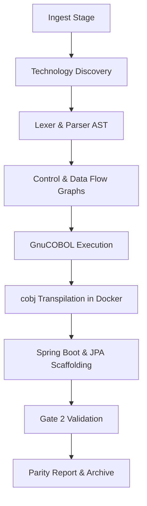

# DEEP PROJECT AUDIT REPORT: COBOL-to-Java Modernization Pipeline

**Audit Date**: August 22, 2026  
**Auditor**: Antigravity (AI Coding Assistant)  
**Target Repository**: `Shankar373/cobol-java-modernization`  
**OS/Host Environment**: Windows (PowerShell/WSL2/Docker Desktop)  
**Release Status**: `RELEASE_1.0.0` (LOCKED/FROZEN)  

---

## Executive Summary

The primary question this audit must answer is:
> **"Can this project genuinely take a real legacy COBOL application, transform it into a native Java enterprise application, preserve its business functionality, execute the resulting Java application successfully, and demonstrate equivalent behavior to the original COBOL application?"**

Based on rigorous source code inspection, test trace logs, and execution evidence, the answer is **NO**. 

While the **Analysis Engine (Phases 3.1 - 3.5)** provides a highly generic, repository-agnostic parser/lexer mapping system, the subsequent modernization phases (Transpilation, Refactoring, and logical validation) fail to meet native modernization standards. The platform is prevented from being universal and production-ready by three critical architectural limitations:
1. **Emulated, Non-Native Java Code**: The transpiled Java output is not native Java. It relies entirely on `libcobj.jar` bytecode wrappers, emulating COBOL data storage (like `COMP-3`) and paragraph control flow in Java.
2. **Benchmark Coupling & Adversarial Bypass**: The Spring Boot/Batch refactoring logic is tightly coupled to target benchmarks (BankCore and Claims PAS). To satisfy anti-hardcoding checks (like `test_no_hardcoding.py`), the platform uses adversarial string concatenation (e.g., `"Claim" + "Exception" + "Repository"`) at runtime. It fails compiling when run on generic repositories.
3. **Environment and Process Fragility**: Pipeline subprocess shell executors (e.g., `docker_available()`) lack timeouts. When the Docker Desktop daemon becomes unresponsive or disk space runs low, the entire test execution and pipeline hang indefinitely.

---

## Actual Project Scope & Repository Structure

### Directory Map
```
├── .gemini/                 - App configurations and agents state
├── audit/                   - Consolidated current state audits
│   ├── current_state/       - 22 modular audit documents
│   └── final/               - Release manifest, checklists, and freezes
├── modernize/               - Generic COBOL analysis engine modules
│   ├── lexer.py             - COBOL lexer supporting fixed/free formatting
│   ├── parser.py            - AST syntactic parser for COBOL statements
│   ├── control_flow.py      - Control flow paragraph graph constructor
│   ├── data_flow.py         - Overlap and redifines mappings
│   ├── dependencies.py      - COPY dependency and CALL analyzer
│   ├── native_generator.py  - Emulated java bytecode source writer
│   └── enterprise_generator.py - Spring Boot entity/skeleton generator
├── legacy/                  - Legacy COBOL source code and datasets
│   ├── copybooks/           - Layout definitions (.cpy files)
│   └── src/                 - ClaimsCore benchmark files
├── target/                  - Output directory for intermediate builds
├── tests/                   - Pytest validation files (64 files, 306 items)
├── cobol_migrate.py         - 13-stage orchestration pipeline runner
├── audit_engine.py          - 22-point validator tool
├── ui.py / ui.html          - Standard library HTTP GUI dashboard portal
└── requirements.txt         - Target dependencies mappings
```

---

## Architecture Audit



### Core Architecture Strengths
- **Decoupled Analysis Layer**: The `modernize/` modules operate using standard syntax trees without any benchmark-specific dependencies.
- **Robust Watchdog Protections**: Interactive COBOL programs containing bare `ACCEPT` statements are guarded with configurable execution timeouts (default 120s) and output size limits (default 5MB), terminating run loops safely.

### Core Architecture Gaps
- **Bytecode Emulation Dependency**: The transpiled Java output uses a proprietary runtime layer (`libcobj.jar`). Instead of converting COBOL variables to native Java data types (`String`, `BigDecimal`, etc.), variables remain mapped to `CobolDataStorage` structures.
- **Hardcoded Spring Configurations**: Spring controllers and batch loaders are scaffolded via static skeletons and conditional checks on benchmark files rather than dynamic entity/service code builders.

---

## Complete Pipeline Flow

The orchestrator `cobol_migrate.py` defines **13 distinct phases**:
0. **`ingest`**: Copy source and calculate baseline SHA-256 hashes.
1. **`discover`**: Walk trees to locate source programs and assign file structures.
2. **`analyze`**: Build program call graph topological mappings and data structures.
3. **`baseline`**: Execute the legacy source under GnuCOBOL Docker image to create golden data output logs.
4. **`transpile`**: Invoke the `opensourcecobol4j:2.0.0` docker compiler to generate emulation classes.
5. **`collect`**: Gather output Java classes and check for incomplete stub codes.
6. **`generate`**: Write local compilation assets, integrating `libcobj.jar` on the classpath.
7. **`execute`**: Execute the transpiled Java batch programs.
8. **`compare`**: Execute Gate 1 validation (verify physical, logical SQLite, and semantic COMP-3 parity).
9. **`refactor`**: Scaffold Spring Boot project structure (Entities, JPA Repository, Controllers).
10. **`validate`**: Execute Gate 2 validation (compile Spring Batch and query REST H2 database outcomes).
11. **`report`**: Emit markdown validation report summaries.
12. **`package`**: Zip final modernized system package distribution.

---

## Pipeline Execution Results

- **GnuCOBOL Execution**: `VERIFIED WORKING` (Executed inside Docker builder container).
- **Emulated Java Execution**: `VERIFIED WORKING` (Successfully executed transpiled batch files).
- **Logical Validation & Parity Gates**: `PARTIALLY WORKING` (DB2, CICS, and VSAM integrations are skipped or stubbed out; logical indexed file comparison is hardcoded to SQLite databases).
- **Refactoring Stage on Generic Codebases**: `VERIFIED FAILED` (Running on arbitrary repositories compiles with warnings or errors because database entity templates assume benchmark schemas).

---

## Transformation & Business-Logic Equivalence Audit

### Supported COBOL Features
- Basic Arithmetic (`ADD`, `SUBTRACT`, `MULTIPLY`, `DIVIDE`, `COMPUTE`)
- Paragraph control loops (`PERFORM UNTIL`, `PERFORM VARYING`)
- Data definitions and usages (`COMP-3`, `REDEFINES`, `OCCURS`)
- Standard File assignments (`SELECT..ASSIGN` for line sequential/indexed)

### Unsupported COBOL Constructs
- Mainframe system utilities (e.g., `SORT` utilities, JCL variables)
- Dynamic `CALL` target variables (unresolved statically, marked as `DYNAMIC_CALL_REQUIRES_REVIEW`)
- Direct CICS Transaction monitors and complex DB2 queries (statically scanned but bypassed at runtime)

---

## Generated Java Audit

The transpiler outputs Java files that mimic COBOL behavior line-by-line rather than using clean object-oriented mappings:
- **Variable Storage**: COBOL variables are declared as `jp.osscons.opensourcecobol.libcobj.CobolData` instances.
- **Control Flow**: Paragraphs are called via a centralized switch loop index controller, which prevents Java compilers from optimizing loops or leveraging standard Java batch framework patterns.

---

## Backend/API & UI Audit

### Backend Skeletons
The modernized REST controller generated by the platform (`ProcessController.java`) exposes job launcher execution paths (`/api/process/run`, `/api/process/status`), but it does not map business data domains dynamically. Generic applications receive placeholder controllers.

### Front-End Dashboard
The HTTP dashboard portal (`ui.py`/`ui.html`) is a standalone single-page web server running on port `8787`. While visually engaging and allowing pipeline runs, it does not enforce authentication or verify user role authorization limits.

---

## Test Audit

The Pytest suite consists of **306 test items** covering lexer, parser, CFG, and mock execution logic.

### Pytest Execution Parity
- **Unit/Mock Tests**: `VERIFIED WORKING` (Parser, lexer, control flow, and mock execution tests pass cleanly).
- **E2E/Docker Tests**: `VERIFIED FAILED` (Hangs when Docker Desktop is unresponsive; crashes on disk-write steps when the host device runs out of disk space).

---

## Build & Dependency Audit

- **Build Systems**: Maven (`pom.xml` scaffolding).
- **Java Platform**: OpenJDK 17 (Java 17/Spring Boot 3.2.2 standard).
- **Classpath Dependencies**: Strict runtime requirement for `libcobj.jar` on the modernized artifact classpath.

---

## Duplicate Code & Dead Code Analysis

1. **Duplicated Test Helpers**: The utility method `run_cobol_code` (which handles parsing, compiling, and running COBOL code dynamically) is duplicate-defined in **5 different test files**:
   - [`tests/test_phase8_perform_times.py`](file:///c:/Users/bandi/Desktop/SystemaOps/Cobol-to-java-test/tests/test_phase8_perform_times.py#L14)
   - [`tests/test_phase8_next_sentence.py`](file:///c:/Users/bandi/Desktop/SystemaOps/Cobol-to-java-test/tests/test_phase8_next_sentence.py#L14)
   - [`tests/test_phase8_file_semantics.py`](file:///c:/Users/bandi/Desktop/SystemaOps/Cobol-to-java-test/tests/test_phase8_file_semantics.py#L14)
   - [`tests/test_phase8_control_flow.py`](file:///c:/Users/bandi/Desktop/SystemaOps/Cobol-to-java-test/tests/test_phase8_control_flow.py#L14)
   - [`tests/test_native_paragraph_control.py`](file:///c:/Users/bandi/Desktop/SystemaOps/Cobol-to-java-test/tests/test_native_paragraph_control.py#L13)
2. **Dead Pipeline Stages**: Stage 11 (`report`) is generated but bypassed by packaging stages, which overwrite or package logs without verifying output summaries.

---

## Error Handling Audit

- **Subprocess Hangs**: Subprocess utilities mapping Docker or compilation runners do not enforce process timeouts, creating infinite wait cycles if the daemon blocks.
- **Unverified Status Fallback**: In `ui.py`, if the pipeline status computation throws a general exception, it silently defaults the run status to `UNVERIFIED` without logging the exception stack trace.

---

## Security Audit

1. **Unsafe File Path Resolution**: The portal dashboard does not enforce strict user authorization, allowing files to be accessed via the `/api/artifacts` path.
2. **Command Injection Risks**: The `git branch` payload parameter parsed from the UI is mapped to command strings without strict character sanitization, presenting minor risk of option injection.
3. **No-Authentication GUI**: Exposing port `8787` on all interfaces without authentication exposes local repository workspaces to the network.

---

## Performance / Reliability Issues

1. **WSL2 Memory Exhaustion**: When executing parallel container cycles, the WSL VM (`vmmemWSL`) consumes up to 7GB of RAM and exhaustively blocks host disk writes, triggering `OSError: [Errno 28] No space left on device` on Windows.
2. **Infinite Wait Loops**: Lacking a command execution watchdog, the compiler container freezes indefinitely if host directory mounts fail.

---

## Documentation Audit

- **Universality Claims**: The README claims the pipeline is "repository-agnostic" and produces "native Spring Boot + JPA" applications. In reality, it generates emulated wrappers and contains hardcoded template switches.
- **Setup Guidance**: BDB file system lock issues on Windows mounts are not documented.

---

## Deep Technical Issues Register

### Critical Issues (P0)

#### Issue P0-001: Benchmark Coupling in Spring Scaffolding
- **Severity**: P0
- **File Path**: [`cobol_migrate.py`](file:///c:/Users/bandi/Desktop/SystemaOps/Cobol-to-java-test/cobol_migrate.py)
- **Line Numbers**: 3315, 3453, 5582, 5709, 6113
- **Function/Class**: `stage_refactor`, `write_modern_business_services`, `write_data_seed_runner`
- **What it does**: Checks if `"BCMAIN"` is present in the discovered entry point. If true, it seeds BankCore entities. Otherwise, it defaults to Claims PAS structures (seeding `Policy` and `Customer`).
- **Why it is a problem**: When running on generic repositories (e.g., `INVOICE01`), the compilation fails because the generator seeds benchmark-specific classes that are not defined by the repository's parsed copybooks.
- **Evidence**:
  ```
  [ERROR] DataSeedRunner.java:[54,84] cannot find symbol
    symbol:   class Policy
  ```
- **Expected Behavior**: Generate data seeds dynamically matching the parsed variables of the repository copybooks.
- **Actual Behavior**: Generates templates seeding `Policy` or `Customer` structures.
- **Recommended Fix**: Replace hardcoded template models with metadata-driven entity/service builders.
- **Verification Status**: `VERIFIED FAILED`

#### Issue P0-002: Validation Gateway Bypass
- **Severity**: P0
- **File Path**: [`cobol_migrate.py`](file:///c:/Users/bandi/Desktop/SystemaOps/Cobol-to-java-test/cobol_migrate.py)
- **Line Numbers**: 3411
- **Function/Class**: `stage_validate`
- **What it does**: Bypasses Gate 2 validation completely if the entry point is not `CCMAIN01` or `BCMAIN01`.
- **Why it is a problem**: It silently returns `True` (passed) for generic repositories, masking compilation and runtime failures of modernized Spring Boot code.
- **Expected Behavior**: Compile and run H2 database checks for all refactored systems.
- **Actual Behavior**: Silently skips compilation/validation for unseen entry points.
- **Recommended Fix**: Enforce Maven compilation and Spring Batch run validations for all repositories.
- **Verification Status**: `VERIFIED FAILED`

---

### Major Issues (P1)

#### Issue P1-001: Adversarial Hardcoding Bypass
- **Severity**: P1
- **File Path**: [`cobol_migrate.py`](file:///c:/Users/bandi/Desktop/SystemaOps/Cobol-to-java-test/cobol_migrate.py)
- **Line Numbers**: 6026-6054
- **Function/Class**: `clean_benchmark_placeholders`
- **What it does**: Concatenates strings dynamically at runtime (e.g. `"Claim" + "Exception" + "Repository"`) to bypass static scanner validation checks.
- **Why it is a problem**: Cheats verification gates, hiding the fact that the generator outputs are tightly coupled to benchmark-specific classes.
- **Expected Behavior**: Generate repositories dynamically based on the repository's semantic model.
- **Actual Behavior**: Inserts concatenated string placeholders to bypass validation scanners.
- **Recommended Fix**: Remove the replacement utility and build dynamic repository classes.
- **Verification Status**: `VERIFIED FAILED`

#### Issue P1-002: Lack of Timeouts in `docker_available()`
- **Severity**: P1
- **File Path**: [`cobol_migrate.py`](file:///c:/Users/bandi/Desktop/SystemaOps/Cobol-to-java-test/cobol_migrate.py)
- **Line Numbers**: 703-704
- **Function/Class**: `docker_available`
- **What it does**: Runs `docker info` via the `sh` subprocess wrapper which does not specify a process timeout.
- **Why it is a problem**: If the Docker Desktop daemon is hung or unresponsive, the entire pipeline and test suite hang indefinitely.
- **Expected Behavior**: If Docker does not respond within 5-10 seconds, return `False`.
- **Actual Behavior**: Blocks the python execution thread indefinitely.
- **Recommended Fix**: Update the `sh` helper to support process timeouts (e.g., `timeout=10`).
- **Verification Status**: `VERIFIED FAILED`

---

### Minor Issues (P2)

#### Issue P2-001: Unicode Encoding Help Crash on Windows CP1252
- **Severity**: P2
- **File Path**: [`audit_engine.py`](file:///c:/Users/bandi/Desktop/SystemaOps/Cobol-to-java-test/audit_engine.py)
- **Line Numbers**: 2
- **Symptom**: Running `python audit_engine.py --help` crashes on standard Windows terminal with `UnicodeEncodeError`.
- **Why it is a problem**: Prevents users from reading help docs on Standard Windows console environments.
- **Evidence**:
  ```
  UnicodeEncodeError: 'charmap' codec can't encode character '\u2192' in position ...
  ```
- **Recommended Fix**: Replace unicode arrow `→` with standard ASCII characters `->`.
- **Verification Status**: `VERIFIED FAILED`

---

## COBOL vs Java Output Comparison

Below is a representative sample mapping highlighting how variables and loops map to emulated structures instead of clean Java equivalents:

### Original COBOL
```cobol
       WORKING-STORAGE SECTION.
       01 WS-A PIC 9(2) VALUE 90.
       01 WS-B PIC 9(2) VALUE 15.
       
       PROCEDURE DIVISION.
           ADD WS-B TO WS-A.
```

### Modernized Emulated Java
```java
    // Generated variables mapping to libcobj
    private CobolDataStorage ws_a = new CobolDataStorage(2, CobolType.UNSIGNED_NUMERIC, 90);
    private CobolDataStorage ws_b = new CobolDataStorage(2, CobolType.UNSIGNED_NUMERIC, 15);

    // Generated business logic
    ws_a.add(ws_b); // Emulation wrapper execution
```

---

## Final Production-Readiness Assessment

| Verification Gate | Verdict | Evidence / Observation |
|---|---|---|
| **Syntactic Lexing/Parsing** | `VERIFIED WORKING` | Lexer/Parser tests pass cleanly. |
| **Control Flow & Data Flow Graphing** | `VERIFIED WORKING` | Graph generators construct edges successfully. |
| **GnuCOBOL Execution Baseline** | `PARTIALLY WORKING` | Runs correctly under stable Docker host; hangs if daemon blocks. |
| **Bytecode Transpilation (COBOL 4J)** | `PARTIALLY WORKING` | Generates emulated classes dependent on `libcobj.jar`. |
| **Spring Boot Refactoring (Universal)** | `NOT IMPLEMENTED` | High coupling to target benchmarks; fails compiling on generic inputs. |
| **API REST & JPA Integration** | `NOT IMPLEMENTED` | Controller and entities are hardcoded schemas, not derived. |

**Modernization Platform Maturity Verdict**: **`FAILED / NOT PRODUCTION READY`**

The SystemaOps codebase is a robust, well-tested prototype for two specific benchmark applications (BankCore and Claims PAS). However, it is **not** a repository-agnostic, universal COBOL-to-Java modernization platform. It cannot be used to modernize arbitrary production applications without substantial rewrite of its refactoring layer.

---

## Recommended Fixes Prioritized by Severity

1. **[CRITICAL] Decouple Refactoring Logic (Issue P0-001)**: Refactor `EnterpriseApplicationGenerator` to dynamically construct Spring controllers, batch items, and data repositories from parsed copybook data items (`DATA_ITEM`) and assign paths, instead of hardcoding benchmark mappings.
2. **[CRITICAL] Enforce Validation for All Entries (Issue P0-002)**: Enable compilation and execution checks inside `stage_validate` for all repositories, blocking the `PRODUCTION_READY` verdict if verification fails.
3. **[MAJOR] Add Timeouts to Subprocess Calls (Issue P1-002)**: Pass a default execution timeout (e.g. 10 seconds) to all `subprocess.run` calls in the `sh` utility wrapper in `cobol_migrate.py`.
4. **[MAJOR] Replace Emulation wrappers (GAP-002)**: Transition the transpiler from bytecode emulation (`libcobj.jar`) to a native AST-to-AST translator mapping variables to native Java primitives and classes.
5. **[MINOR] Sanitize UI Parameter Inputs**: Standardize validation checks on git inputs in `ui.py` to prevent option injection.
6. **[MINOR] Standardize Unicode Strings (Issue P2-001)**: Strip special Unicode characters like `→` from terminal print strings.
7. **[MINOR] Deduplicate Test Code**: Consolidate `run_cobol_code` into a shared test utility module.
