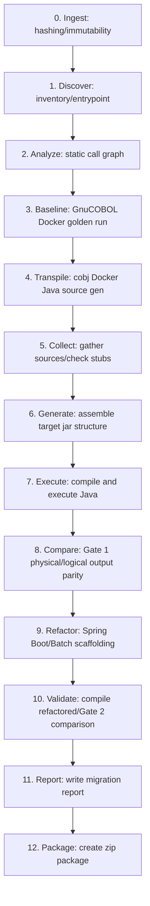
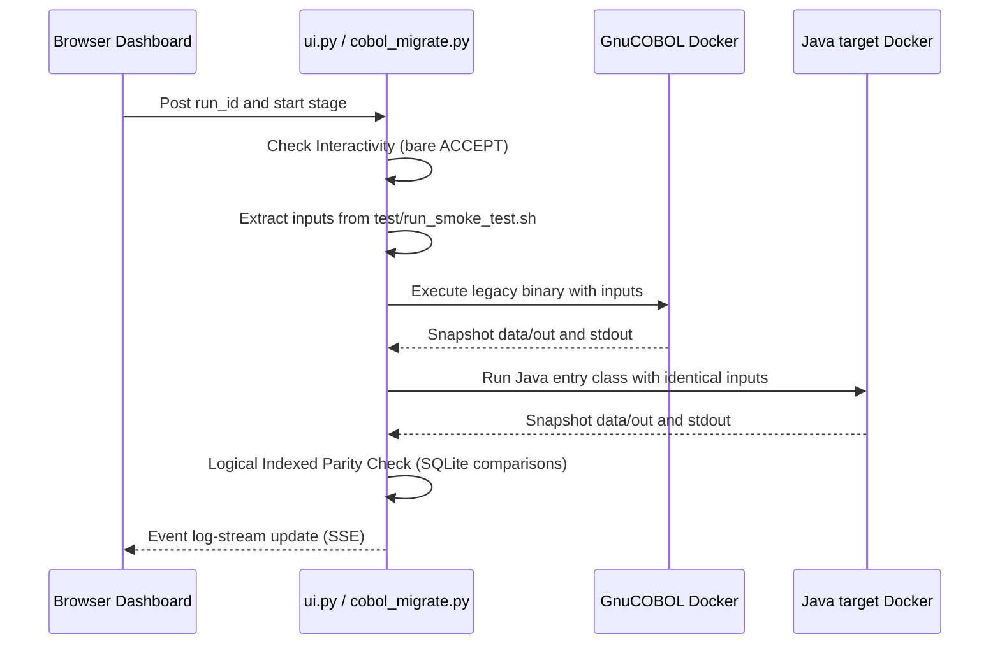

# Phase 5: Reconstructed Pipeline Architecture

This document describes the flow and component interactions of the SystemaOps pipeline.

## 1. High-Level Pipeline Workflow

## 2. Interactive Execution Sequence

