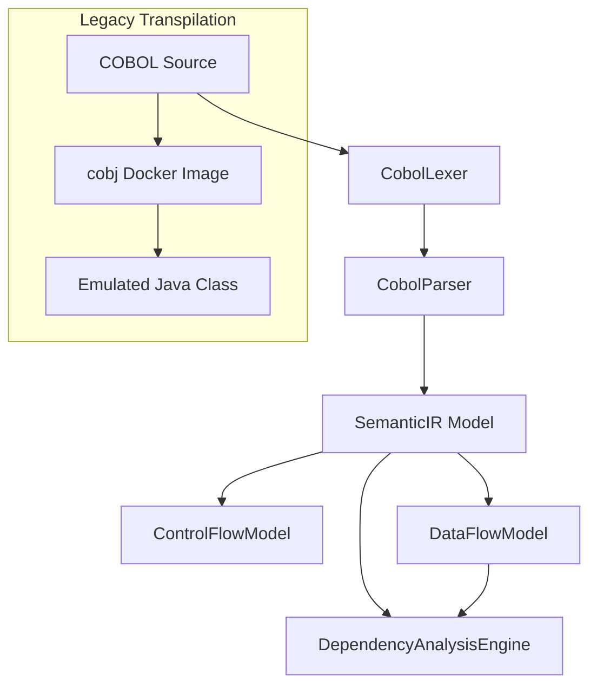

# 16. Architecture Audit

This document examines the modularity, decoupling, and structural separation of components.

---

## 1. Modular Separation Matrix

| Component | Coupling | Architectural Verdict |
| :--- | :---: | :--- |
| **Lexer & Parser** | `DECOUPLED` | Clean library interfaces, consuming/producing standard models. |
| **Semantic IR** | `DECOUPLED` | Fully serializable representation of COBOL structural units. |
| **CFG, Data Flow & Dependencies** | `DECOUPLED` | Clean downstream pipelines consuming Semantic IR models. |
| **Transpiler orchestrator** | `HIGHLY COUPLED` | Relies on Docker container execution environments and local mount folders. |
| **Native Java Refactoring** | `HIGHLY COUPLED` | Hardcoded templates targeting specific benchmark shapes. |

---

## 2. Structural Pipeline Representation

