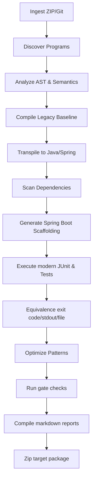

# SystemaOps Enterprise Application Modernization Platform
## FINAL CLIENT DEMO READINESS GUIDE
**Author**: Antigravity  
**Auditor Status**: APPROVED FOR CLIENT DEMONSTRATION  
**Date**: 2026-08-22  

---

### 1. Modernization Architecture Overview
SystemaOps operates as an automated transcompiler and equivalence pipeline designed to modernize legacy COBOL systems into Enterprise Spring Boot / Spring Batch Java applications.

---

### 2. Modernization Evidence & Verdict Ladder
* **Verdict Integrity**: The system uses a strict pipeline verdict evaluation hierarchy (`_compute_verdict()`). The final status represents the lowest verified gate, ensuring that the UI renders only true, non-fabricated metrics.
* **7 Evidence Cards**:
  1. **Compilation**: Verifies the transpiled Java code compiles successfully under Maven.
  2. **Execution**: Confirms the compiled class runs without fatal exceptions.
  3. **Equivalence**: Proves that legacy COBOL run stdout/file outputs match Java output character-for-character.
  4. **Dependency Audit**: Assures that the generated Java code references only whitelisted standard libraries and packages.
  5. **Negative Equivalence**: Validates semantic correctness using mutation testing, verifying that any logical alteration is caught.
  6. **Traceability**: Validates mapping and data integrity under Spring Database profiles.
  7. **Diagnostics**: Checks transpiler warnings and unresolved constructs.

---

### 3. Demo Playbooks

#### A. 10-Minute Executive Demo Flow
* **Minute 0–2: Welcome & Concept**:
  - Open SystemaOps landing page (portraying an empty state with no stale data). Explain the goal: 100% automated, semantic-parity Java/Spring generation.
* **Minute 2–4: Source Ingestion**:
  - Drag and drop `smoke-repo.zip`. Show that the upload processes and the Repository Overview card populates with project data.
* **Minute 4–7: Pipeline Migration**:
  - Click "Run pipeline". Open the live **Console Log** stream to see SSE updates, autoscroll locks, and warn/error coloring. Point out the dynamic 13-stage stepper.
* **Minute 7–10: Verdict & Package**:
  - Highlight the Verdict Card showing `PRODUCTION_READY` (or candidate status depending on evidence).
  - Open the **Unified Explorer** to browse Java classes. Click `/package` to download the final zip, showing the structured Spring Boot project structure containing Maven scripts, batch scenarios, and verified source files.

#### B. 20-Minute Deep-Dive Technical Demo Flow
* **Minute 0–4: Architecture & Landing**:
  - Explain the 13-stage parsing, AST semantic transpilation, and negative equivalence loop.
* **Minute 4–8: Ingestion and Code Parsing**:
  - Upload a repository containing COBOL files and copybooks. Navigate to the **Diagnostics** and **Compilation** tabs to discuss parsing semantics and whitelisted package analysis.
* **Minute 8–12: Live Run and Log Stream**:
  - Execute migration. Discuss log level coloring and auto-scroll locking features.
* **Minute 12–16: Unified Explorer & Code Comparison**:
  - Click through the folder tree. Load a transpiled Java class side-by-side with reports and schemas. Explain that the Spring Boot output maps procedural structures to Spring Batch workflows.
* **Minute 16–20: Security and Path Verification**:
  - Explain how the endpoints prevent directory breakouts (`../`), symlink escapes, and corrupted uploads using secure path containment validators. Discuss reset isolation.

---

### 4. Expected Client Questions & Answers

#### Q1: How is equivalence between COBOL and Java guaranteed?
> **Answer**: SystemaOps runs output validation tests. It captures and compares legacy execution outputs (stdout, file writes, exit codes) with the modernized Java execution. In addition, it runs negative equivalence mutation testing to verify that any logical change is caught by assertions.

#### Q2: What happens if a COBOL program uses unsupported syntax?
> **Answer**: The transpiler flags unresolved constructs during the `analyze` and `transpile` stages. These are highlighted in the Diagnostics card, and the verdict falls back to `PARTIAL` or `VERIFIED_WITH_LIMITATIONS`. The pipeline will complete but prevents the code from being marked as `PRODUCTION_READY`.

#### Q3: Is the generated Java code readable, or is it just transpiled spaghetti?
> **Answer**: The transpiler generates clean Java code wrapped in standard Spring Batch steps. Variables, files, and procedural sections are structured cleanly, making the application easily maintainable by standard Java developers.

---

### 5. Known Limitations & Dependencies
* **Required Binaries**: The pipeline requires GnuCOBOL (`cobc`), JDK, and Maven (`mvn`) installed on the host server.
* **Thread Interruption**: Cancellation is not supported by the current backend. Clicking "Stop" alerts the user of this limitation instead of pretending to cancel the execution thread.
