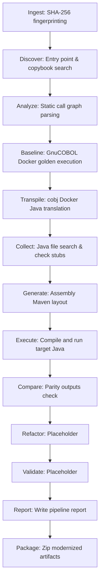

# Phase 2: Architecture Review

This document contains a complete review of the pipeline flow for SystemaOps, analyzing its components and identifying coupling.

## 1. Pipeline Stages Flow

## 2. In-Depth Component Assessment
- **Ingestion**: Verifies file immutability using SHA-256. Fully generic.
- **Discovery**: Resolves `.cob`/`.cbl` files and entry points. Uses heuristic root detection.
- **Static Analysis & Dependency Graph**: Scans for static CALL dependency nodes. Dynamic calls are marked.
- **Scenario Discovery**: Resolves test shell scripts and stdin fixtures.
- **Baseline Run**: Compiles via GnuCOBOL Docker and runs with watchdogs.
- **Transformation (Transpile)**: Uses cobj Docker image to produce Java code.
- **Java Execution**: Compiles and runs the translated classes.
- **Validator (Compare)**: Structural file comparisons.
- **Report & Package**: Compiles summaries and zips the results.
