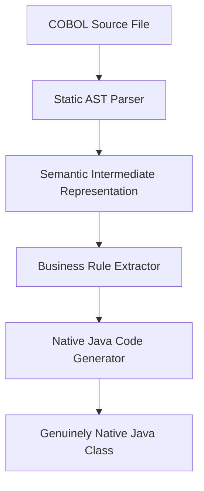

# Phase 2: Native Java Modernization Design

This document defines the architectural path to native Java code generation:

## 1. Modernization Pipeline Design

## 2. Genuinely Native Java Characteristics
- **Zero Emulation Coupling**: No imports of `libcobj.jar` or OpenSourceCOBOL4J runtime libraries.
- **Data Mappings**: COBOL structures map to native types:
  - `PIC X` -> `String`
  - `PIC 9` -> `int` / `long`
  - `COMP-3` decimal fields -> `BigDecimal`
- **Control Flows**: Paragraph blocks translate to semantic private methods.
