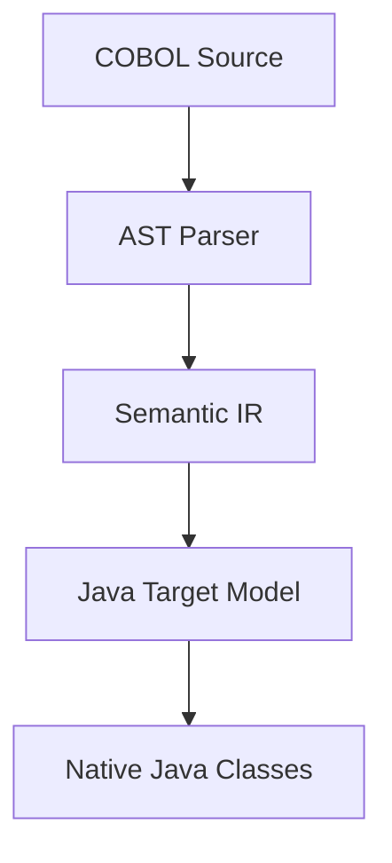

# Phase 2: Generic Native Java Architecture

To ensure modernization maps COBOL to clean native code, the generator maps from intermediate models:

## 1. Native Java Transformation Chain

## 2. Target Component Classification
- **NATIVE_JAVA**: Code runs independently of libcobj wrappers.
- **RUNTIME_EMULATED**: Code remains tightly coupled to libcobj emulation.
- **HYBRID**: Hybrid structures combining wrappers and native classes.
- **UNSUPPORTED**: Code containing unsupported syntax constructs.
