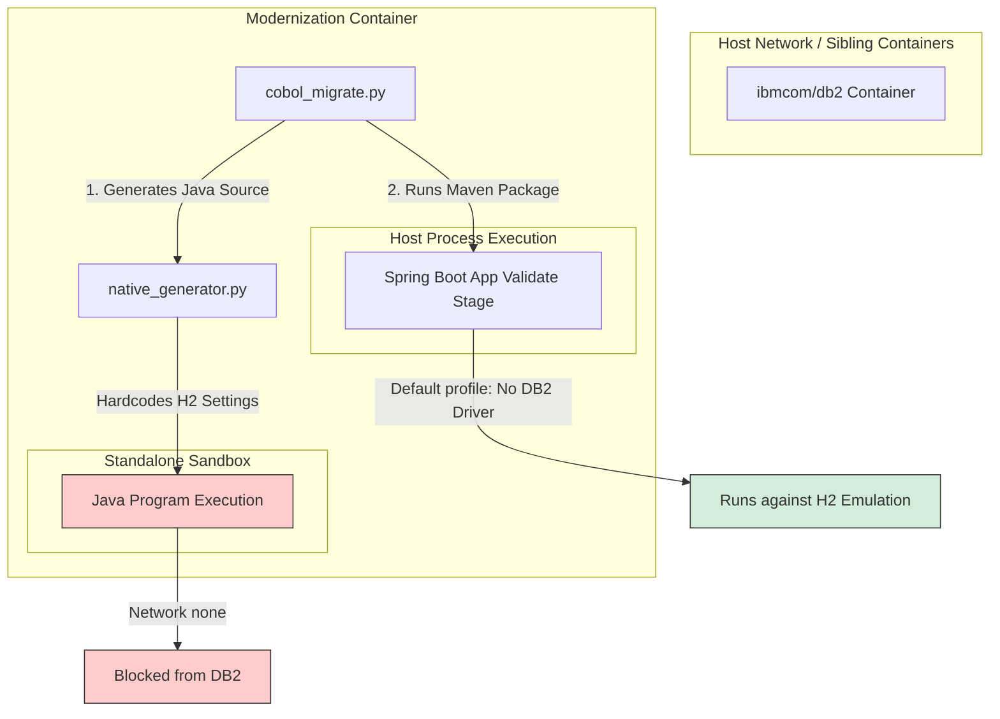

# DB2 Architecture & Verification Readiness Report
## COBOL → Java Modernization Platform

This report analyzes the architecture, execution paths, configurations, and blockers for conducting **real DB2 verification** on the COBOL-to-Java Modernization Platform. Every finding is backed by evidence from the codebase, test suites, and Docker configurations.

---

## Part 1: Answers to Specific Questions

### A. Docker Compose Service Analysis
**Does `docker compose` currently start only the modernization platform, or does it also start DB2?**
- **Verdict**: Only the modernization platform.
- **Evidence**: `docker-compose.yml` defines only a single service: `cobol-modernizer` (using `Dockerfile`). There is no service block for an IBM DB2 container.

---

### B. Docker Network & Inter-Container Connectivity
**Can the modernization container connect to a separate DB2 container running on the same Docker network?**
- **Verdict**: **Partially**.
  - **Spring Boot Validation (Gate 2)**: **Yes**. It is run on the host's network namespace (inside the container's network context) via `subprocess.Popen` in `cobol_migrate.py:4362`. It inherits the network namespace of `cobol-modernizer`, enabling it to resolve and connect to sibling services by name (e.g. `jdbc:db2://db2:50000/MYDB`).
  - **Standalone Java Execution (Stage 8 `execute`)**: **No**. Sibling execution containers are launched via Docker-out-of-Docker (DooD) using `scenario_runner.py:_docker_cmd` which hardcodes `"--network", "none"` (line 219). This prevents any network access from standalone Java execute runs.

---

### C. Environment Variable Utilization Check
**Does the current code actually use: `DB2_URL`, `DB2_USERNAME`, `DB2_PASSWORD`, `DB2_SCHEMA`, `REAL_DB2_MODE`?**
- **`DB2_URL`**: **Yes**. Used in `cobol_migrate.py` line 299 (`run_real_db2_validation`) to check TCP reachability, and in `enterprise_generator.py` line 300 to generate dynamic Spring properties: `spring.datasource.url=${DB2_URL:...}`.
- **`DB2_USERNAME`**: **Yes**. Generated in `application.properties` via `enterprise_generator.py` line 302: `spring.datasource.username=${DB2_USERNAME:sa}`. In `cobol_migrate.py` line 4894, it is only logged to check configuration status.
- **`DB2_PASSWORD`**: **Yes**. Generated in `application.properties` via `enterprise_generator.py` line 303: `spring.datasource.password=${DB2_PASSWORD:}`. In `cobol_migrate.py` line 4895, it is only logged to check configuration status.
- **`DB2_SCHEMA`**: **No**. It is only logged in `cobol_migrate.py` line 4896 to report if it is configured. It is **never** interpolated into JDBC configurations or used in SQL compilation/migration.
- **`REAL_DB2_MODE`**: **Yes**. Controls strict status classification in `cobol_migrate.py:classify_db2_status` and controls assertions in the DB2 test suites.

---

### D. DB2 JDBC URL Configuration Guide
**What exact DB2 JDBC URL should be used in the following contexts?**
- **DB2 on localhost (host machine)**:
  - `jdbc:db2://host.docker.internal:50000/DATABASE` (enables the containerized platform to bridge out to the host's localhost loopback).
- **DB2 in another Docker Compose service (e.g., named `db2`)**:
  - `jdbc:db2://db2:50000/DATABASE` (resolves via Docker DNS).
- **DB2 on a remote server**:
  - `jdbc:db2://<remote-ip-or-fqdn>:<port>/DATABASE` (e.g., `jdbc:db2://192.168.1.150:50000/SAMPLE`).

---

### E. Database Connection vs. Emulation
**Does the generated Java/Spring application actually connect to DB2, or is DB2 currently only classified/emulated?**
- **Verdict**: **Emulated (H2) for all active verification runs**.
- **Evidence**:
  1. **Pipeline Execution (Stage 8)**: The transpiled Java source generated by `native_generator.py:4463-4467` has **hardcoded H2 parameters**:
     ```java
     dataSource.setDriverClassName("org.h2.Driver");
     dataSource.setUrl("jdbc:h2:mem:testdb;DB_CLOSE_DELAY=-1;DB_CLOSE_ON_EXIT=FALSE");
     dataSource.setUsername("sa");
     dataSource.setPassword("");
     ```
     This completely bypasses environment settings when running the Java program in the pipeline.
  2. **Maven Build (Gate 2)**: Stage 11 `validate` packages the Spring Boot app using `mvn clean package` (`cobol_migrate.py:4266`) without profile selection. The DB2 profile containing the JCC driver (`enterprise_generator.py:278`) is inactive, meaning the Spring Boot application lacks the DB2 JCC driver on its classpath.

---

### F. Real DB2 Validation Framework Audit
**Does the real DB2 validation framework perform: connection → SQL execution → result capture → COBOL baseline comparison → Java comparison?**
- **Verdict**: **No**.
- **Evidence**:
  1. **Dead Code**: The function `run_real_db2_validation` defined in `cobol_migrate.py` line 286 is **never invoked** anywhere in the active pipeline orchestrator.
  2. **Placeholder Logic**: Even if called, the logic is a stub. As documented at line 397:
     ```python
     # Placeholder: with a real DB2 server we could compare per-operation
     # results.  For now we report PARTIAL because server data will differ
     # from the local baseline.
     ```
     No query result set comparisons are implemented.

---

### G. Blockers Preventing Real DB2 Equivalence Verification
Before the platform can run a complete E2E DB2 equivalence loop, the following architectural gaps must be resolved:

1. **GnuCOBOL SQL Precompiler Absence**: GnuCOBOL cannot compile native `EXEC SQL` blocks. Baseline compilation for DB2 test repositories (e.g., `DB2SELECT01.cob`) fails with build errors, preventing the capture of baseline observations (`stdout.txt` and DB state).
2. **Hardcoded H2 Database Configurations**: The transpilation stage writes H2 credentials directly into the generated Java source files. Standalone runs cannot redirect to DB2.
3. **Execution Sandbox Network Restrictions**: `scenario_runner.py` uses `--network none` for execution containers, blocking the TCP connection to any external DB2 database in stage 8.
4. **Build Tooling Profiles**: Stage 11 validation compile command does not pass `-Pdb2`, preventing JCC driver resolution.
5. **Validation Code is Stubbed**: Result-set parity verification (comparing DB2 states before and after COBOL/Java execution) is not implemented.

---

### H. DB2 Service Integration Feasibility
**Determine whether adding a DB2 service to `docker-compose.yml` is safe and compatible with the existing architecture.**
- **Safety**: **Safe**. It adds a standard relational container and does not modify core application binaries.
- **Compatibility**: **Incompatible without codebase adjustments**. Merely adding the service will not result in DB2 execution because the pipeline will still execute standalone runs inside `--network none` sandboxes and against hardcoded H2 DB configurations.

---

## Part 2: Detailed Architectural Mapping


