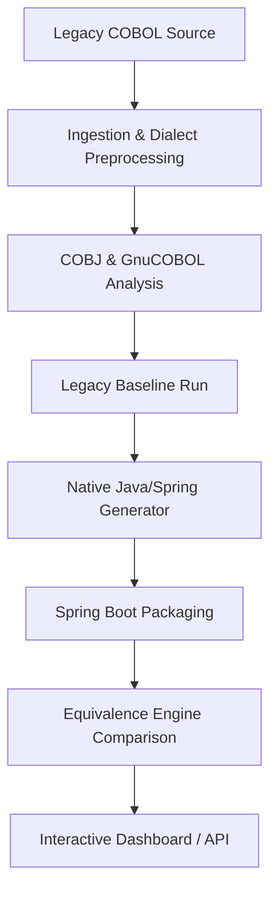

# COBOL to Native Java/Spring Modernization Platform — Project Handoff

## 1. Project Purpose
This platform is a prototype modernization compiler and validation engine designed to transform legacy COBOL programs into Native Java and Spring Boot/Spring Batch applications. A key differentiator is its **automated business-equivalence validation framework**, which executes the legacy COBOL application inside a GnuCOBOL Docker container, intercepts standard input/output/file side effects, executes the generated Java application, and performs a strict field-level comparison of the side effects to verify functional equivalence.

---

## 2. Architecture



*   **Ingestion/Analysis**: Normalizes dialect differences (IBM, CICS, DB2) and extracts source metadata.
*   **Orchestrator (`cobol_migrate.py`)**: Drives the 13-stage migration pipeline.
*   **Docker-out-of-Docker (DooD)**: The orchestrator runs in a container and controls the host's Docker daemon via the mounted `/var/run/docker.sock` to spin up sibling compilers and runtimes.
*   **Equivalence Engine**: Compares console outputs, files, and database state records to guarantee that semantic behavior remains identical post-modernization.

---

## 3. Current Capabilities
The system is a working **MVP (Minimum Viable Product)** that can modernise structured, file-based Batch COBOL programs with simple sequential operations.

### Supported COBOL Features
*   **Basic Arithmetic & Control Flow**: `ADD`, `SUBTRACT`, `MULTIPLY`, `DIVIDE`, `PERFORM`, `EVALUATE`, `IF/ELSE`.
*   **Data Types**: Structured `PICTURE` clauses (`9`, `X`, `S9`, `V9`, usage of `COMP` / `COMP-3` parsed via the helper).
*   **Sequential Files**: `OPEN`, `READ`, `WRITE`, `CLOSE` operations.
*   **Copybooks**: Discovers and resolves local COPY files.

---

## 4. Pipeline Stages
The orchestrator executes a canonical 13-stage lifecycle:
1.  **Ingest (0)**: Accepts repository file trees, calculates cryptographic hashes for immutability.
2.  **Discover (1)**: Catalogs source files, copybooks, and config files.
3.  **Analyze (2)**: Builds call graphs, entry-point mappings, and data structures.
4.  **Baseline (3)**: Compiles and runs the legacy COBOL code inside a GnuCOBOL container, capturing output.
5.  **Transpile (4)**: Converts COBOL code to Java classes using the `opensourcecobol4j:2.0.0` parser.
6.  **Modernize (5)**: Translates transpiled Java to idiomatic Spring Boot or Spring Batch architecture.
7.  **Generate (6)**: Emits generated source code files, build scripts (`pom.xml`), and configurations.
8.  **Build (7)**: Compiles the modernized Java project using Maven inside a sibling JDK container.
9.  **Execute (8)**: Executes the compiled Java application, recording outputs and side effects.
10. **Verify (9)**: Compares the execution artifacts of the Java run against the GnuCOBOL baseline run.
11. **Gate 1 (10)**: Enforces functional correctness (asserts 100% equivalence match).
12. **Gate 2 (11)**: Runs semantic mutation checks to assert test adequacy and detect gaps.
13. **Package (12)**: Generates the final deployable artifact ZIP and documentation.

---

## 5. Subsystem Status & Gaps

### DB2 Status
*   **Implementation Status**: `EMULATED` (via H2 Database).
*   **Real DB2 Status**: `ENVIRONMENT_BLOCKED` / `NOT_VERIFIED`. There is no reachable, real DB2 server configured. In the absence of a verified DB2 connection, the platform defaults to H2 database emulation for local testing.
*   **Verification Gap**: The system can parse SQL blocks and translate them to JDBC equivalents, but SQL compatibility and transaction semantics have only been verified against H2, not a real IBM DB2 server.

### CICS Status
*   **Implementation Status**: `PARTIAL` / `EMULATED`.
*   **Real CICS Status**: `NOT_PROVEN`.
*   **Gap**: CICS preprocessing resolves syntax constructs, but real mainframe transaction controls, program-to-program links (`EXEC CICS LINK`), and terminal communication are stubbed rather than transpiled to equivalents (like Spring MVC).

### VSAM Status
*   **Implementation Status**: `PARTIAL` (Sequential file access is supported).
*   **Real VSAM Status**: `NOT_PROVEN` for Indexed/Relative modes.
*   **Gap**: The equivalence engine validates sequential records, but VSAM Keyed Sequenced Data Sets (KSDS) and Relative Record Data Sets (RRDS) lack complete semantic verification.

### JCL Status
*   **Implementation Status**: `NOT_PROVEN`.
*   **Gap**: The framework parses JCL layout structures to map batch chains, but executing actual JCL scripts or converting complex step topologies automatically to Spring Batch XML/Java configuration remains stubbed/framework-only.

### Dynamic CALL Status
*   **Implementation Status**: `UNSUPPORTED` / `REQUIRES_MANUAL_REVIEW`.
*   **Gap**: Dynamic `CALL identifier` statements cannot be statically resolved. When encountered, they are marked with `DYNAMIC_CALL_REQUIRES_REVIEW` and must be manually resolved by an engineer.

---

## 6. Dockerization & Deployment Status
*   **Status**: `READY`.
*   **Python Version**: `3.12.3` (provided natively by `eclipse-temurin:17-jdk-noble`).
*   **Docker-out-of-Docker (DooD)**: Fully resolved.
    *   **The Blocker**: Sibling containers (`cobj`, `gnucobol`) could not mount subdirectories of the host volume `/app/workspace` because named volumes cannot have subdirectories mounted.
    *   **The Solution**: We modified `docker_run` and `_docker_cmd` to mount the entire `cobol-to-java-test_workspace` volume to `/app/workspace` inside the sibling, and used a `cd / && rm -rf <guest> && ln -sf <host> <guest> && cd <workdir>` wrapper inside the container's shell to map guest mounts dynamically and prevent directory inode lock errors.
    *   **Execution Verification**: End-to-end containerized runs of `A-PAYONLY` and `INVMGR` now successfully complete all 13 stages, achieving `VERIFIED_WITH_LIMITATIONS`.

---

## 7. Security Hardening
The platform incorporates several critical security controls:
1.  **Loopback Binding**: The dashboard binds to `127.0.0.1` by default. When bound to all interfaces (`0.0.0.0`), a fail-closed HTTP Basic Authentication (`admin:admin` or custom credentials) is enforced.
2.  **Path Traversal Prevention**: Filenames and run IDs are strictly validated to prevent traversal (e.g. `../`, `/etc/passwd`).
3.  **Shell Injection Blocking**: Command interpolation into Docker containers uses tokenization and strict character allowlists to prevent shell metacharacter injections.
4.  **Resource Limits**: Container runs are restricted with `--memory=2g`, `--cpus=2`, and `--pids-limit=512`.
5.  **DooD Warning**: Sharing the host's `/var/run/docker.sock` allows containers to control the host Docker daemon. While `no-new-privileges:true` is applied to drop capabilities, this path remains root-equivalent and must be restricted to isolated execution environments.

---

## 8. Test Evidence
*   **Host Tests**: Run `python -m pytest` (509 tests, 508 passed, 1 xpassed).
*   **E2E Container Verification**: Executing `python scratch/blackbox_test.py` validates the complete pipeline flow within the Dockerized deployment:
    *   `A-PAYONLY`: Completed end-to-end (`done`, Stage 12).
    *   `INVMGR`: Completed end-to-end (`done`, Stage 12).
    *   `F-PAYFAIL`: Fails at Stage 4 Transpile due to deliberate syntax errors (Correct target behavior).
    *   `Path Traversal Probes`: Confirmed blocked with `HTTP 400`.

---

## 9. Next Developer's Priorities

### P0 — Must Fix Before Production
*   **Docker Socket Isolation**: Replace host-mounted Docker socket access (`/var/run/docker.sock`) with a secure remote Docker TCP endpoint protected by TLS certificates to mitigate root privilege escalation risks.
*   **Production Credentials**: Implement a secret manager or encrypted environment variables for `UI_AUTH_CREDENTIALS` instead of committing default values to the repository.

### P1 — Important Next Work
*   **Dynamic CALL Handler**: Implement a pluggable runtime registry to map dynamic `CALL` targets without manual orchestration code generation.
*   **VSAM Indexing**: Add support for indexed VSAM file operations (using GnuCOBOL's VBISAM/BDB file system formats).

### P2 — Future Enhancements
*   **Modern Web UI**: Upgrade the minimal vanilla CSS dashboard to a responsive dashboard using React or Next.js.
*   **Real DB2 Testing**: Add a Dockerized DB2 service container to the `docker-compose.yml` to support local integration tests against a real database instance instead of H2.

---

## 10. How to Start and Test

### Start Platform Locally
```bash
python ui.py --port 8787
```

### Start Platform via Docker Compose
```bash
docker compose build
docker compose up -d
```

### Run Verification Script
```bash
python scratch/blackbox_test.py
```
